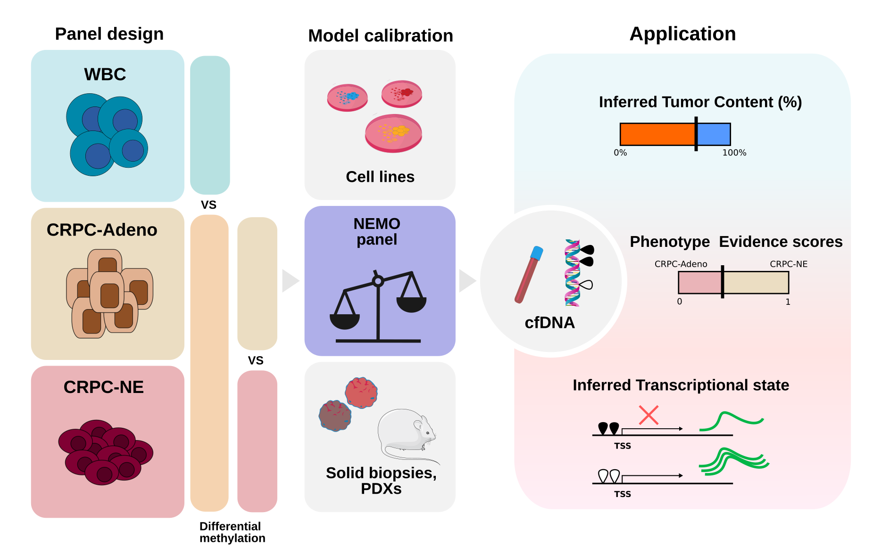
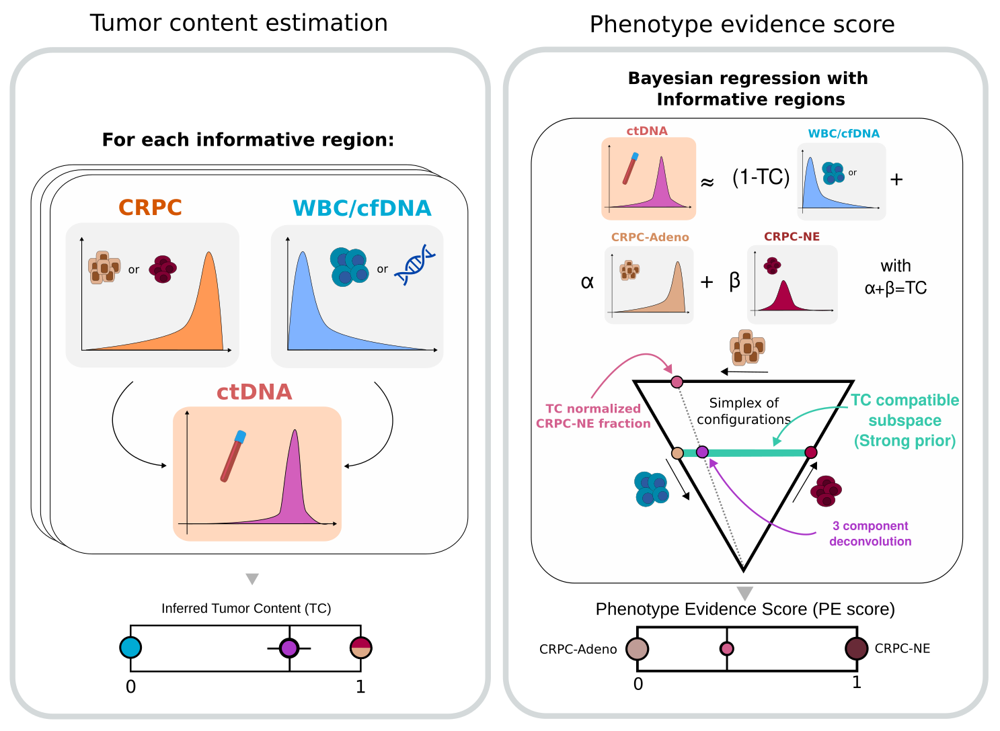

<!-- README.md is generated from README.Rmd. Please edit that file -->

```{r, include = FALSE}
knitr::opts_chunk$set(
  collapse = TRUE,
  comment = "#>",
  fig.path = "man/figures/README-",
  out.width = "100%"
)
```

# Non-invasive detection of neuroendocrine prostate cancer through targeted cell-free DNA methylation

<!-- badges: start -->

[](https://codecov.io/gh/GMFranceschini/NEMOcode)
[](https://cran.r-project.org/web/licenses/MIT)
[](https://doi.org/10.5281/zenodo.7887998)

<!-- badges: end -->

 *Schematic of NEMO panel design,
validation, and application*

**Important note**: this is the internal and fully functional version of the repository.
It includes the panel design, which is currently undisclosed. 

### Do not share this repository outside the group without approval.

## Description

This repository contains the required code to perform circulating Tumor
Content estimation (TC) and Phenotype Evidence score (PE score)
estimation from DNA methylation data generated (or masked) using the
NEMO assay. The NEMO assay is a tailored sequencing panel to monitor
CRPC through cell-free DNA (cfDNA) methylation and ultimately provide
detection of treatment-induced neuroendocrine prostate cancer. The
following steps estimate those clinically relevant quantities starting
from DNA methylation counts obtained from BS-seq techniques. For more
details, please see the original manuscript ([link](link)).

Notice that, in principle, masked whole genome bisulfite sequencing data
can be used to generate per-region Beta values. Even though the signal
quality will likely be lower due to limited coverage, we successfully
applied our method to a collection of WGBS and eRRBS datasets obtaining
coherent results.

Notably, the presented scripts are tailored for the NEMO panel design
and were not developed to be more general deconvolution or tumor
estimation strategies. While the same principles can be applied to other
tumor types or settings, our approach is not guaranteed to work beyond
its scope.

### Data availability

Preprocessed data, including DNA methylation, counts for samples
profiled with NEMO, and per-region DNA methylation values for all
samples analyzed, are available in Zenodo
[link](http://dx.doi.org/10.5281/zenodo.7887998). Raw WGBS data are
available from dbgap (WGBS, phs001752.v2-ctDNA_NE_CRPC_v2). Raw
sequencing data for samples profiled with NEMO are available upon
request due to privacy concerns. All results from the paper can be
produced using only DNA methylation counts data.

A minimal guide to obtain NEMO estimation from raw data (DNA methylation
counts from Bismark) is outlined below.

### Data preparation

Raw data has been processed using a standard pipeline for DNA
methylation (nf-core/methylseq, version 1.6 (
[link](https://nf-co.re/methylseq/1.6/docs/usage) ). DNA methylation
counts in bismark format, and hg19 coordinates are required as a
starting input. Examples of such input files can be found in
`inst/extdata/`. Other types of inputs can be adapted, provided that per
CpG DNA methylation counts are available. The first functions
`collect_beta_panel()` and `collapse_stats()` use the input counts to
estimate a region-wise DNA methylation value (Beta). For each sample and
each region in the NEMO design, the average Beta value is computed as
the fraction of methylated CpGs over the total (first per CpG, then per
region). Our analyses retain only CpGs with at least 10x coverage, even
though this constraint can be relaxed. The output of this step can be
formatted into a matrix that recapitulates the average DNA methylation
level for each sample and each informative region.

 *Tumor content and Phenotype Evidence
score inference strategies*

### Inference of Tumor Content

53 regions of the NEMO panel have been selected to estimate tumor
content in circulation. Those regions are differentially methylated
between CRPC samples (no matter their class) and white blood cells. As
white blood cells are the major contributors to the healthy cfDNA pool,
those regions provide the ideal signal to estimate the relative
contribution of tumor derived DNA in circulation. The estimation
procedure leverages reference values from a collection of healthy cfDNA
samples (Fox-Fisher et al. eLIFE 2021) and the fact that each region has
opposite states in CRPC and healthy cfDNA. The function
`compute_score_ic()` produces a tumor content estimation for each sample
and a stability interval which results from the iterative downsampling
of the informative regions. Our tests indicate that this strategy can
quantify tumor presence up to 3%.

### Inference of PE score

Once the tumor content is known, the main goal of the analysis is to
infer the presence of CRPC-NE derived DNA. As differential DNA
methylation between CRPC-Adeno and CRPC-NE has been previously
characterized, we leverage a set of informative regions to achieve this
goal. The inference procedure builds upon the tumor content estimation
and aims at reconstructing the observed signal as a linear combination
of CRPC-NE, CRPC-Adeno, and healthy cfDNA signal. To this end, an atlas
with reference profiles generated with high tumor-content tissue samples
has been generated and is available in the `resource` folder. The
reconstruction task is performed through a Bayesian linear regression
`compute_all()`/`compute_evidence_brms()`, which computes the most
likely fractions of each cell type. A strong prior is used for the
healthy cfDNA signal, as it is equal to one minus the tumor content,
while a non-informative prior is used for the NE and Adeno components.
The relative error of the estimation is computed as the maximum standard
error across NE and Adeno fractions, divided by the total tumor content
(currently, this statististic is not used). Notice that the PE score is
not reliable when the tumor content is below 3%, while we recommend
caution in interpreting the PE score between 3% and 10% of tumor
content.

### Installation

You can install the current version of NEMOcode from
[GitHub](https://github.com/) with:

``` r
# install.packages("devtools")
install.packages("brms")
devtools::install_github("GMFranceschini/NEMOcode")
```

### Requirements

These package has been tested with R version `4.1.2` and Ubuntu 22.04. A
series of additioal packages will be installed to make `NEMOcode` work.
Those dependencies are listed in the `DESCRIPTION` file. The `brms`
package might require additional care for the installation, see this
[link](https://learnb4ss.github.io/learnB4SS/articles/install-brms.html)
for help.\
Installation of the package should take few minutes.

## Example

```{r, message=FALSE}
library(dplyr)
library(tidyr)
library(NEMOcode)
```

### Preparation

First, we load a small set of data included in the package. Those
samples have been profiled with the NEMO assay, and this data is in a
standard form of raw counts. The three examples include a CRPC organoid
with stem-cell like features (`PM155_P`), a cell-free DNA sample from an
healthy donor (`HD1`), a neuroendocrine cell line (`NCI-H660`), and the
VCaP CRPC cell line (`VCaP`).

```{r}

fpath1 <- system.file("extdata", "PM155_P-run_pilotCells_unif.RData", package="NEMOcode")
fpath2 <- system.file("extdata", "HD1-run_pilot_cfDNA_unif.RData", package="NEMOcode")
fpath3 <- system.file("extdata", "VCaP-run_pilotCells_unif.RData", package="NEMOcode")
fpath4 <- system.file("extdata", "NCI-H660-run_pilotCells2_unif.RData", package="NEMOcode")

exfile1 = local(get(load(fpath1)))
exfile2 = local(get(load(fpath2)))
exfile3 = local(get(load(fpath3)))
exfile4 = local(get(load(fpath4)))

head(exfile1)

```

The first step of the analysis is to reduce the input data to region
level DNA methylation, using the panel design as reference. For each
region, the average DNA methylation (Beta) is computed. The high local
autocorrelation of DNA methylation supports the idea of collapsing
contiguous CpGs to obtain a robust signal.

```{r, message=FALSE}

list_counts = list("PM155_P" = exfile1, "HD1" = exfile2, "VCaP" = exfile3, "NCI-H660" = exfile4)
pdes = NEMOcode::panel_design
coll_regs = list()

for (i in names(list_counts)){
    
    colldes = collect_beta_panel(cov_file = list_counts[[i]], panel_design = pdes)
    statsdes = collapse_stats(colldes, ssid = i)
    coll_regs[[i]] = statsdes
}

coll_regs = bind_rows(coll_regs) %>% arrange(sampleID, reg_id)
head(coll_regs)


```

Now we can turn the result into matrix form, using the average Beta
value per region as entry. This will be the main input for tumor content
estimation and PE score estimation.

```{r}

test_mat = coll_regs %>% 
    ungroup() %>% 
    select(sampleID, mean_meth, reg_id) %>% 
    pivot_wider(names_from = sampleID, values_from = mean_meth) %>% 
    as.data.frame()

to_matrix<-function(x) {
    n = x[,1]
    m<-as.matrix(x[,2:ncol(x)])
    rownames(m)<-x[,1]
    m
}


test_mat = to_matrix(test_mat)
head(test_mat)

```

### Tumor content estimation

The next step is tumor content estimation. In this case, only the tumor
informative regions are used (`mCRPC_PBMC`, as they have CRPC specific
signal against the white blood cell background).

```{r, message=FALSE}

ptc = pdes %>% filter(region_set == "mCRPC_PBMC")
control_mat = NEMOcode::control_mat

test_mat_tc = test_mat[ptc$reg_id, ]
control_mat = control_mat[ptc$reg_id, ]

state = ptc %>% select(reg_id, meth_state)

res = compute_ci_confidence(
    tumor_mat = test_mat_tc, 
    control_mat = control_mat,
    reg_df = state,
    nsub = 100,
    quant_prob = 0.05,
    frac_sub = 0.5
    )

res

```

As expected, the cfDNA sample from an healthy donor is estimated to have
a tumor content (`est_mu`) below 3%, our sensitivity threshold, and thus
it can be considered negative for tumor. On the other hand, all CRPC
models produce a tumor content of 1, as expected.

### Phenotype Evidence score estimation

Once the tumor content is known, the final step is to estimate the
relative contributions of CRPC-NE, CRPC-Adeno, and cfDNA. In this case,
another set of informative regions is used (a collection of regions
resulted from differential methylation analysis between CRPC-Adeno and
CRPC-NE samples). Importantly, the tumor content is known and it is fed
to the function, informing the expected relative fraction of CRPC signal
over the total. In the `compute_all()` function it is possible to
indicate a set of samples for which `cfDNA` is the expected background,
instead of `PBMC` (default). Furthermore, one can enforce the tumor
content estimation to be 1 by adding the sample name to `atlas_samples`.

```{r, message=FALSE}

ppe = pdes %>%
    filter(
        region_set %in% c(
            "rockermeth_NEvsAdeno",
            "NE_Adeno",
            "CpG_site_DNAmeth_classifierJCI_2020"
        )
    )

refDist = NEMOcode::refDist
rownames(refDist) = refDist$reg_id

## Use only common rows and ensure that the order is the same
kk = base::intersect(rownames(refDist), ppe$reg_id)
refDist = refDist[kk,]
obs_all = test_mat[kk, ]

result = compute_all(
    obs_all,
    ref_mat = refDist,
    atlas_tc = res,
    atlas_samples = c(),
    cfdna_ids = c("HD1"),
    sequential = T
)

result

```

The results report the relative contributions of the three expected
populations `ne`, `adeno` and `immune`. The `pe` score is computed as
`ne/(ne+adeno)`, and reflects the degree of neuroendocrine
differentiation of tumor derived DNA.

Notice that the runtime for each sample can be in the order of few
minutes, as the bayesian regression employs numerical methods to
estimate regression parameters. For this reason, the analysis of a large
dataset might require parallelization over multiple cores on a machine
with good computational power (parallelization is already implemented in
`compute_all()` function. `sequential=TRUE` sets sequential computation.
`nclust` can be used to indicate the number of threads to use).

The relative error and variability score are simple metrics to measure
reconstruction accuracy. Currently, they are not used but were
considered to set the lower limit of PE score estimation. Their usage
will possibly be considered in future implementation. The same holds for
the confidence interval of the PE score, which is currently a
placeholder. The quality flag variable simply reports weather the sample
has the minimum tumor content to perform an estimation (3%) or not.

To reproduce the score reported in the paper simply run the scoring
functions on the corresponding data deposited in
[Zenodo](https://doi.org/10.5281/zenodo.7887998). Computed scores for
analyzed samples are also available as Supplementary Data in our study
(Franceschini et al., ...).
